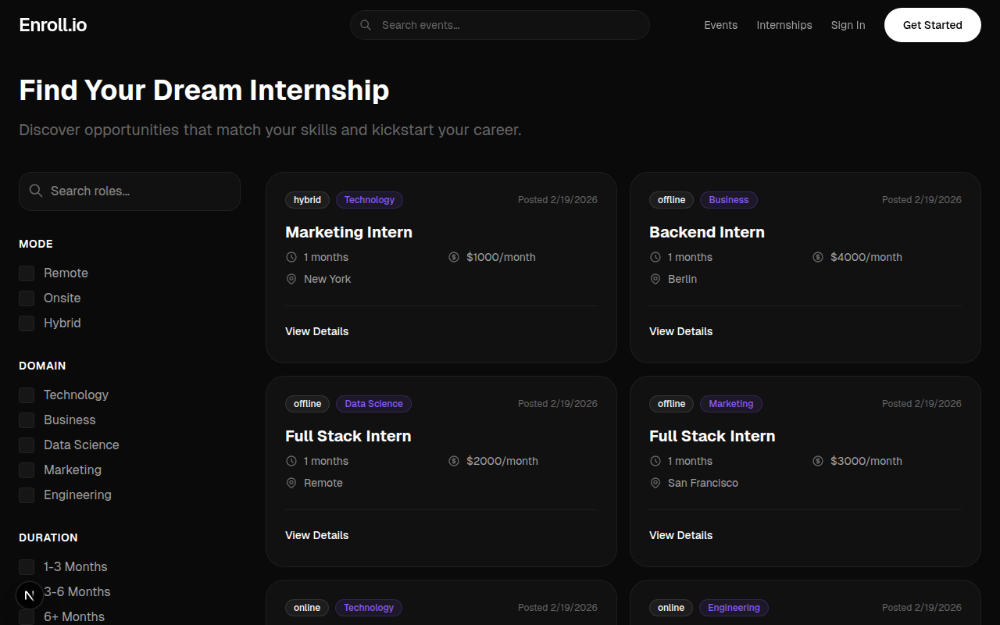
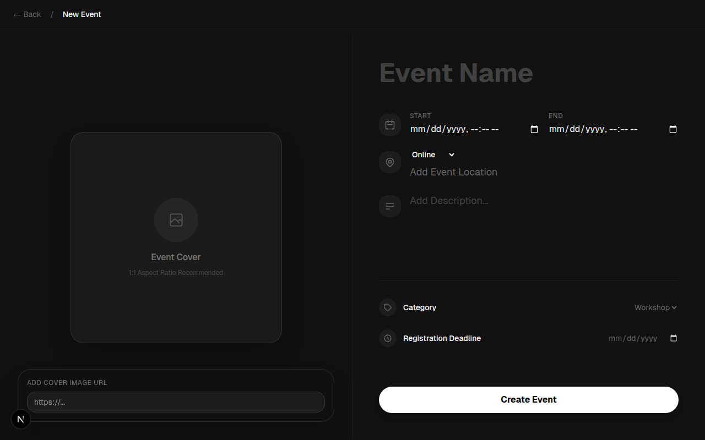
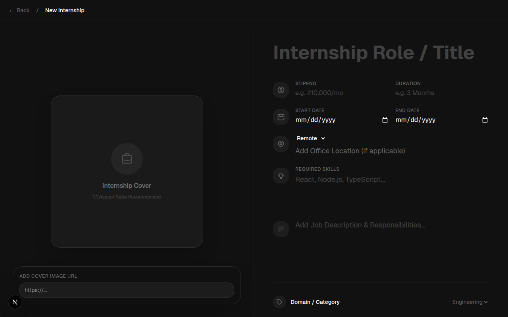

# Enrollio

> **Submission for LogicRush Hackathon**  
> **Topic 9**: Event & Internship Pipeline  
> **Team**: Code Red  
> **Members**: Rudra Agarwal (Team Lead), Priyanshu Singh, Arpit Gupta, Deepanshu Khatri
>
> **The Problem**: High administrative burden for organizing programs.  
> **Proposed Solution**: End-to-end management with auto-generated certificates.  
> **UI/UX Compulsory Element**: Enrollment Stepper.  
> **Design Goal**: Multi-step form reducing form fatigue.

Enrollio is a comprehensive platform designed to streamline the management and discovery of events and internships. Built with modern web technologies, it offers a seamless experience for both administrators and users.

## Features

-   **Event Management**: Create and manage events with detailed information, including mode (online/offline), location, and dates.
-   **Internship Portal**: Post and apply for internships with specific requirements like stipend, duration, and skills.
-   **Admin Dashboard**: Manage all your programs and track applicants in real-time with Neon DB integration.
-   **User Authentication**: Secure authentication and role-mapping powered by Clerk.
-   **Modern Aesthetics**: Features a sleek, Luma-style dark UI with glassmorphism, dynamic gradients, and full-bleed cover images.

## Tech Stack

-   **Framework**: [Next.js 15](https://nextjs.org/)
-   **Authentication**: [Clerk](https://clerk.com/)
-   **Database**: [Neon](https://neon.tech/) (PostgreSQL)
-   **ORM**: [Drizzle ORM](https://orm.drizzle.team/)
-   **Styling**: [Tailwind CSS](https://tailwindcss.com/)

## Screenshots

### Home Page


### Internships Listing


### Create Event


### Create Internship


## Getting Started

First, run the development server:

```bash
npm run dev
# or
yarn dev
# or
pnpm dev
# or
bun dev
```

Open [http://localhost:3000](http://localhost:3000) with your browser to see the result.

## Database Setup

This project uses Drizzle ORM with Neon.

1.  Configure your `.env` file with `DATABASE_URL`.
2.  Run migrations:
    ```bash
    npm run db:push
    ```
